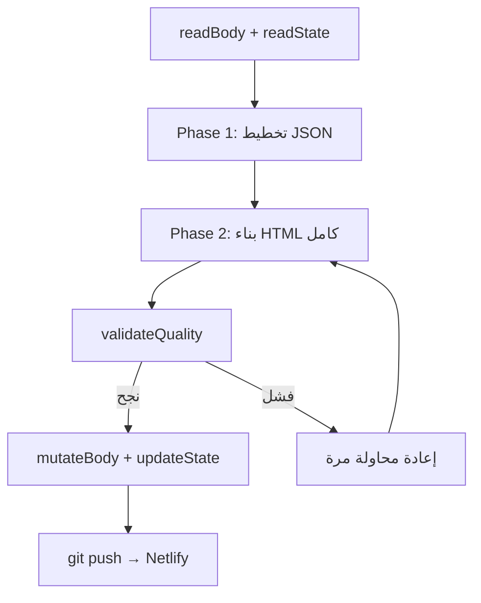

# المراقب الذاتي للشبكة (The Network's Self-Awareness)

نظام يفصل **العقل** (وكيل Node.js محلي) عن **الجسد** (موقع ثابت في `public/`). العقل يخطط ويبني صفحة ويب كونية/سايبرية عبر نموذج **deepseek-r1:14b**، يفحص الجودة، ثم يرفع التحديثات عبر Git لينشرها Netlify.

## البنية

```
AI/
├── agent.js          ← العقل (يعمل محلياً، لا يُرفع لـ Netlify)
├── package.json
├── netlify.toml      ← ينشر مجلد public/ فقط
└── public/           ← الجسد (يُعدَّل ويُرفع)
    ├── index.html
    └── state.json    ← تتبع الجيل والتأملات
```

## المتطلبات

- **Node.js** v18+
- **Ollama** على جهاز بعيد (`10.162.46.208`) مع نموذج `deepseek-r1:14b`
- **Git** مُعد مع وصول push إلى `accelerator007/AI`
- **Netlify** مربوط بالمستودع

## إعداد Ollama على الجهاز البعيد

```bash
ssh ai-lap@10.162.46.208
```

### السماح بالاتصالات من الشبكة

```bash
export OLLAMA_HOST=0.0.0.0
sudo systemctl restart ollama
sudo ufw allow 11434/tcp
```

### سحب النموذج

```bash
ollama pull deepseek-r1:14b
```

### التحقق

```bash
curl http://10.162.46.208:11434/api/tags
```

## التثبيت والتشغيل

```bash
npm install
npm start
```

الوكيل يشغّل دورة فوراً ثم كل **30 دقيقة** (افتراضياً).

> **ملاحظة:** deepseek-r1:14b أبطأ من llama3 (~30–90 ثانية لكل مرحلة). الدورة الكاملة (تخطيط + بناء) قد تستغرق 1–3 دقائق.

## متغيرات البيئة

| المتغير | الافتراضي | الوصف |
|---------|-----------|-------|
| `OLLAMA_URL` | `http://10.162.46.208:11434/api/chat` | عنوان Chat API |
| `OLLAMA_BASE` | `http://10.162.46.208:11434` | قاعدة عنوان Ollama |
| `MODEL` | `deepseek-r1:14b` | اسم النموذج |
| `INTERVAL_MS` | `1800000` | الفترة بين الدورات (30 دقيقة) |
| `THEME` | `cosmic` | الاتجاه البصري |
| `GIT_BRANCH` | `main` | فرع Git للرفع |

### أمثلة

```bash
# اختبار سريع — دورة كل 5 دقائق
INTERVAL_MS=300000 npm start

# نموذج بديل
MODEL=llama3.1:latest npm start
```

## دورة التطور (v2 — ثنائية المراحل)



1. **Phase 1 — التخطيط:** deepseek-r1 يُخرج JSON (فلسفة، ألوان، عناصر UI، تفاعل)
2. **Phase 2 — البناء:** يبني HTML كوني/سايبر كامل من الخطة
3. **validateQuality:** يرفض المخرجات الضعيفة (نص عربي قليل، CSS مكرر، بدون حركة...)
4. **إعادة محاولة:** محاولة ثانية بتحذير إذا رُفضت الجودة
5. **updateState:** تحديث `state.json` (الجيل، التأمل، الخطة)
6. **pushToNetwork:** رفع إلى GitHub → Netlify

## فحص الجودة (Quality Gate)

يرفض HTML قبل الكتابة إذا:

- أقل من 2000 حرف أو أكثر من 50000
- نص عربي أقل من 100 حرف
- أقل من 5 قواعد CSS
- بدون animation أو canvas أو requestAnimationFrame
- تكرار class name 3+ مرات
- تشابه > 90% مع HTML الحالي
- فقرات فارغة

## الحمايات (Failsafes)

- الكتابة **فقط** داخل `public/` — لا يلمس `agent.js`
- `isEvolving` lock يمنع تداخل الدورات
- `try/catch` قوي — الفشل لا يوقف الوكيل
- تنظيف ردود deepseek (إزالة `` و Markdown)
- تخطي `git push` إذا لا تغييرات

## خيار احتياطي: نفق SSH

```bash
ssh -L 11434:localhost:11434 ai-lap@10.162.46.208
OLLAMA_URL=http://localhost:11434/api/chat npm start
```

## النشر على Netlify

1. اربط مستودع `accelerator007/AI`
2. `netlify.toml` يحدد `publish = "public"`
3. كل `git push` يُطلق نشراً جديداً
