# المراقب الذاتي للشبكة (The Network's Self-Awareness)

نظام يفصل **العقل** (وكيل Node.js محلي) عن **الجسد** (موقع ثابت في `public/`). العقل يخطط ويبني صفحة ويب كونية/سايبرية **ثنائية اللغة (عربي + إنجليزي)** عبر **deepseek-r1:14b**، يتحقق من الجودة، ثم يرفع فقط بعد اجتياز الفحص.

## البنية

```
AI/
├── agent.js          ← العقل (v3 — دورة ساعية)
├── package.json
├── netlify.toml
└── public/
    ├── index.html    ← الجسد (AR + EN)
    └── state.json    ← الجيل، التأملات، الفشل الأخير
```

## دورة الساعة (افتراضي)

```mermaid
gantt
  title دورة واحدة = 60 دقيقة
  dateFormat X
  axisFormat %M min

  section active
  developPhase     :0, 10
  verifyPhase      :10, 11

  section rest
  restPhase        :11, 60
```



| المرحلة | المدة | الوظيفة |
|---------|-------|---------|
| **develop** | 10 دقائق | تخطيط JSON + بناء HTML + إعادة محاولة (بدون رفع) |
| **verify** | 1 دقيقة | فحص ثنائي اللغة + مراجعة AI → رفع عند النجاح |
| **rest** | 49 دقيقة | انتظار قبل الدورة التالية |

## المتطلبات

- Node.js v18+
- Ollama على `10.162.46.208` مع `deepseek-r1:14b`
- Git مُعد للـ push إلى `accelerator007/AI`
- Netlify مربوط بالمستودع

## التثبيت والتشغيل

```bash
npm install
npm start
```

## متغيرات البيئة

| المتغير | الافتراضي | الوصف |
|---------|-----------|-------|
| `DEVELOP_MS` | `600000` | مدة التطوير (10 دقائق) |
| `VERIFY_MS` | `60000` | مدة التحقق (1 دقيقة) |
| `CYCLE_MS` | `3600000` | مدة الدورة الكاملة (60 دقيقة) |
| `OLLAMA_URL` | `http://10.162.46.208:11434/api/chat` | Chat API |
| `MODEL` | `deepseek-r1:14b` | النموذج |
| `THEME` | `cosmic` | الاتجاه البصري |
| `GIT_BRANCH` | `main` | فرع Git |

### أمثلة تخصيص

```bash
# 20 دقيقة تطوير + 3 دقائق تحقق + 37 دقيقة راحة
DEVELOP_MS=1200000 VERIFY_MS=180000 CYCLE_MS=3600000 npm start

# اختبار سريع (دقيقتان تطوير + 30 ثانية تحقق + دقيقة راحة)
DEVELOP_MS=120000 VERIFY_MS=30000 CYCLE_MS=210000 npm start
```

## مراحل الدورة

### 1. developPhase (10 دقائق)
- Phase 1: تخطيط JSON (فلسفة عربية + إنجليزية، ألوان، عناصر UI)
- استراحة 15 ثانية
- Phase 2: بناء HTML كامل
- إعادة محاولة حتى نفاد الوقت أو نجاح الفحص الأولي
- **لا كتابة ملفات ولا git push**

### 2. verifyPhase (1 دقيقة)
- فحص آلية: عربي 100+ حرف، إنجليزي 80+ حرف
- رفض: صيني، ياباني، كوري، سيريلي، إسباني/فرنسي
- وجود `<section lang="ar">` و `<section lang="en">` مع 3+ فقرات
- مراجعة AI سريعة (30 ثانية timeout)
- **الرفع فقط عند النجاح:** `mutateBody` → `updateState` → `git push`

### 3. restPhase
- انتظار حتى اكتمال 60 دقيقة من بداية الدورة

## قواعد اللغة

- المحتوى المرئي: **عربي + إنجليزي فقط**
- ممنوع: صيني، ياباني، كوري، إسباني، فرنسي، روسي
- كل فقرة عربية لها مقابل إنجليزي
- أسماء CSS/classes بالإنجليزية (مسموح)

## الحمايات

- الكتابة فقط داخل `public/`
- `isEvolving` lock يمنع تداخل الدورات
- لا رفع عند فشل التحقق — يُسجَّل في `state.json` → `lastFailure`
- `try/catch` — الفشل لا يوقف الوكيل

## إعداد Ollama البعيد

```bash
ssh ai-lap@10.162.46.208
export OLLAMA_HOST=0.0.0.0
sudo systemctl restart ollama
ollama pull deepseek-r1:14b
```

## النشر على Netlify

1. اربط `accelerator007/AI`
2. `netlify.toml` → `publish = "public"`
3. كل `git push` ناجح يُطلق نشراً جديداً
