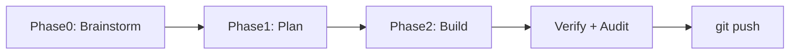

# المراقب الذاتي للشبكة (v4 — Creative Open Brain)

نظام يفصل **العقل** عن **الجسد**. العقل حر الإبداع — يبني ألعاباً، أدوات، قصصاً، وتجارب تفاعلية ثنائية اللغة (عربي + إنجليزي)، ويتطور تراكمياً كل دورة.

## دورة 25 دقيقة (افتراضي)

| المرحلة | المدة | الوظيفة |
|---------|-------|---------|
| **develop** | 15 دقيقة | brainstorm → plan → build (مع تنظيف تلقائي للغات الممنوعة) |
| **verify** | 2 دقيقة | فحص + AI audit → رفع عند النجاح |
| **rest** | 8 دقائق | انتظار قبل الدورة التالية |

## مراحل التفكير



### Phase 0 — Brainstorm (عقل مفتوح)
يختار نوعاً إبداعياً: `mini-game`, `interactive-tool`, `visual-experience`, `story`, `quiz`, `simulation`

### Phase 1 — Plan
يحوّل الفكرة إلى خطة تنفيذية مع هدف تحسين عن الجيل السابق

### Phase 2 — Build
يبني HTML/JS تفاعلي كامل — ليس صفحة زينة

### Verify
- عربي + إنجليزي فقط (رفض CJK/سيريلي/إسباني)
- JavaScript تفاعلي (أحداث click/keydown + منطق)
- AI audit (يرفض ردود قصيرة جداً)

## ذاكرة التطور — `state.json`

```json
{
  "creativeHistory": [{ "generation": 1, "type": "mini-game", "feature": "...", "summary": "..." }],
  "usedCreativeTypes": ["mini-game"],
  "improvementGoal": "Add scoring + sound next cycle"
}
```

## التشغيل

```bash
npm install
npm start
```

## متغيرات البيئة

| المتغير | الافتراضي | الوصف |
|---------|-----------|-------|
| `DEVELOP_MS` | `900000` | 15 دقيقة تطوير |
| `VERIFY_MS` | `120000` | 2 دقيقة تحقق |
| `CYCLE_MS` | `1500000` | 25 دقيقة دورة كاملة |
| `MODEL` | `deepseek-r1:14b` | النموذج |
| `OLLAMA_URL` | `http://10.162.46.208:11434/api/chat` | Chat API |

### تخصيص التوقيت

```bash
# دورة كل ساعة: 20 دقيقة تطوير + 5 تحقق + 35 راحة
DEVELOP_MS=1200000 VERIFY_MS=300000 CYCLE_MS=3600000 npm start
```

## قواعد اللغة

- المحتوى المرئي: **عربي + إنجليزي فقط**
- فحص اللغة على JSON الخطة والـ HTML
- أسماء CSS/JS بالإنجليزية (مسموح)

## الحمايات

- الكتابة فقط في `public/`
- لا رفع عند فشل التحقق → `lastFailure` في state.json
- تطور تراكمي: كل دورة تحتفظ بما بُني وتحسّنه

## النشر

Netlify ينشر `public/` تلقائياً عند كل `git push` ناجح.
